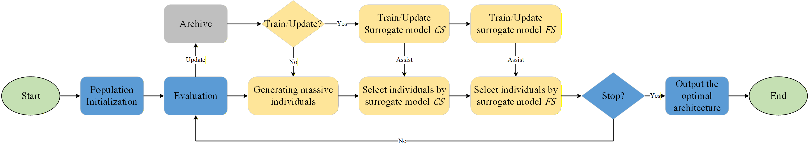
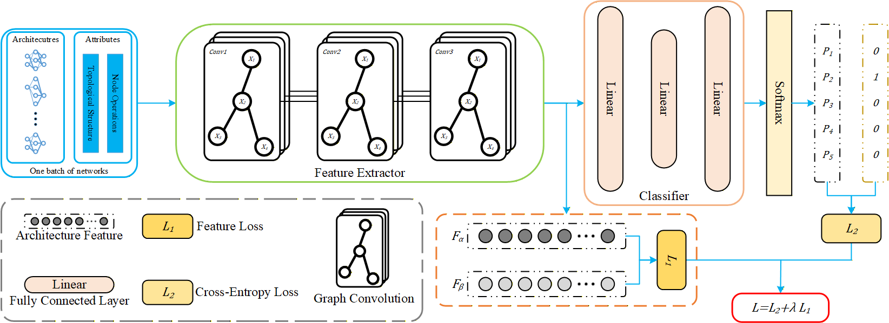
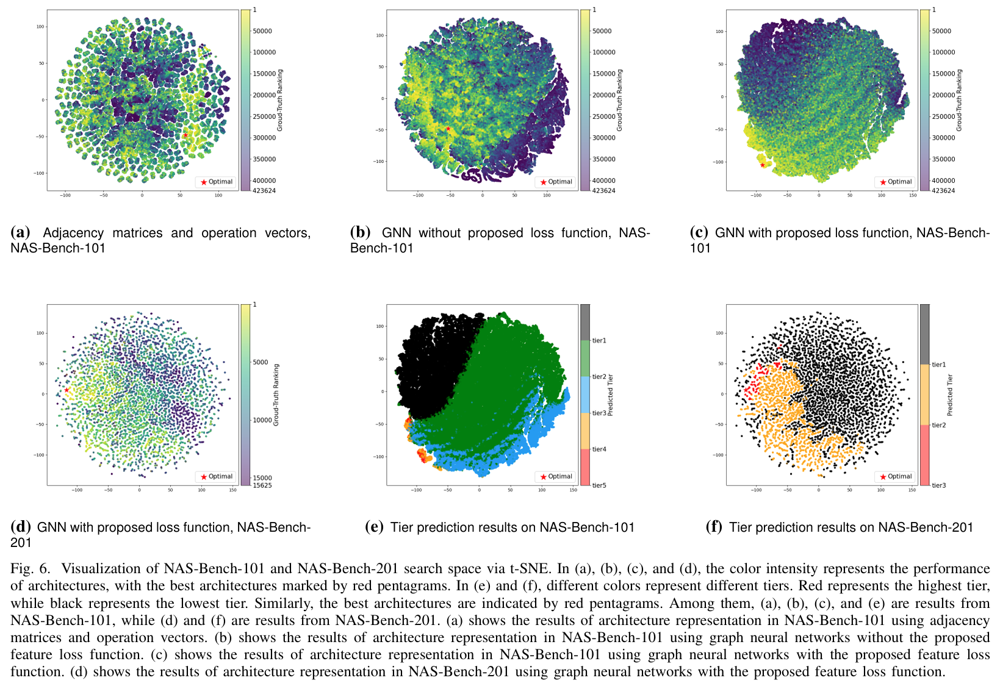

# Graph Neural Network based Surrogate Model for Evolutionary Neural Architecture Search

---

This repository is for the paper "Graph Neural Network based Surrogate Model for Evolutionary Neural Architecture Search" which is accepted by IEEE Transactions on Systems, Man and Cybernetics: Systems.

## Introduction

Evolutionary Neural Architecture Search (ENAS) automates the design of network architectures, but it often requires **extensive computational resources**.  
Many existing ENAS methods rely on surrogate models to reduce costs, yet current architecture representation techniques **lack the expressiveness needed** to build accurate surrogate models.  
Moreover, most studies use a single model or strategy to predict architecture performance, which can be **unreliable or unstable**.

To address these challenges, **DSGENAS** introduces a **dual-stage surrogate model framework based on Graph Neural Networks (GNNs)**:

1. **GNN-based Architecture Embedding:** We model neural architectures as graphs and extract performance-aware, discriminative embeddings using GNNs with a novel feature loss.  
2. **Dual-Stage Surrogate Strategy:** Two complementary surrogate models are employed during the evolutionary search:
   - **Global performance tier learning** for coarse-grained ranking.
   - **Local performance relationship learning** for fine-grained evaluation.

This combination enables **accurate, stable, and efficient performance prediction**, significantly improving the ENAS process.

### 🚀 Highlights

- **Graph-based Architecture Representation:** Captures rich structural information for better surrogate modeling.  
- **Dual-Stage Surrogate Modeling:** Integrates global tier classification and local ranking for robust predictions.  
- **Benchmark Validation:** Demonstrated superior performance and reduced search cost across widely adopted NAS benchmarks.  

## Overview

Our DSGENAS Framework



The overall framework of DSGENAS is illustrated above. The proposed method aims to enhance evolutionary neural architecture search through a dual-stage surrogate model based on GNNs. By integrating these two complementary surrogates into the evolutionary search process, DSGENAS achieves both prediction accuracy and search efficiency.

### The Coarse-grained Surrogate Model



The **coarse-grained surrogate model** focuses on learning the **global performance tiers** of architectures.  
Instead of predicting exact accuracy values, it classifies architectures into discrete performance levels (e.g., top, middle, bottom tiers).  
This stage provides a **global overview** of the search space and helps evolutionary algorithms quickly identify promising architecture regions.  

By filtering out low-quality candidates early, the coarse-grained surrogate improves search efficiency and ensures that only high-potential architectures are passed to the fine-grained evaluation stage.

### The Fine-grained Surrogate Model

The **fine-grained surrogate model** refines the evaluation by learning **pairwise performance relationships** among architectures within the same performance tier.  
It performs a **local ranking** task, predicting which of two candidate architectures is likely to perform better.  
This model captures **subtle structural differences** that affect performance, offering a more precise guidance signal for the evolutionary search.  

Together, the coarse-grained and fine-grained surrogates form a complementary dual-stage system — the first provides global direction, while the second ensures local accuracy, leading to a more stable and effective NAS process.

### Embedding Space Comparison

The following figures visualize and compare the architecture embedding spaces on **NAS-Bench-101** and **NAS-Bench-201** using **t-SNE**.  
Our proposed representation with the feature loss produces more structured, performance-aware embeddings.



## Install

It is recommended to use a virtual `Python` environment. For example, with `Anaconda`, you can run:

```bash
conda create -n dsgenas python==3.7
```

To install the required packages for DSGENAS, run:

```bash
pip install -r requirements.txt
```

⚠️ Make sure you have the correct `PyTorch` version for your GPU. For example, if you are using RTX 3090, please refer to the comments in requirements.txt for a compatible `PyTorch` version.

## Usage

This repository provides the implementation of **DSGENAS**, including architecture representation, dual-stage surrogate modeling, and evolutionary search.  
To reproduce the results in our paper, you can follow these main steps:

1. **Feature Extraction:**  
   Use the provided GNN-based encoder to transform candidate architectures into embedding vectors.  

2. **Surrogate Training:**  
   Train the **coarse-grained** surrogate model for global tier prediction and the **fine-grained** surrogate model for local ranking refinement.  

3. **Evolutionary Search:**  
   Conduct the evolutionary neural architecture search using the trained dual-stage surrogate models.  

4. **Visualization:**  
   Visualize the learned embedding space or search trajectories using t-SNE to analyze the structure–performance relationships.  

All configurations, datasets, and training scripts are organized for easy reproduction and extension.

### 1. Search Spaces Preparation

Before running the search or training the surrogate models, please download the benchmark datasets and place them in the project root directory.

- **[NAS-Bench-101](https://github.com/google-research/nasbench):**  
  Download the official benchmark file `nasbench_only108.tfrecord` and place it in the root folder.

- **[NAS-Bench-201](https://github.com/D-X-Y/NAS-Bench-201):**  
  Obtain the `NAS-Bench-201-v1_1-096897.pth` file (from the `nas_201_api`) and place it in the root folder.

Your directory structure should look like this:

```text
./
├── nasbench/
│ └── nasbench_only108.tfrecord
└── nas_201_api/
│ └── NAS-Bench-201-v1_1-096897.pth
├── requirements.txt
├── main.py
└── ...
```

### 2. Train the Surrogate Model

We provide two types of surrogate models that work cooperatively within the DSGENAS framework.

- **Coarse-grained model (Global Tier Prediction):**  
  This stage learns to classify architectures into global performance tiers.  
  It provides a broad understanding of the search space and helps eliminate low-potential candidates early.

```bash
python TNetwork_on_X01.py
```

- **Fine-grained model (Local Ranking Learning):**
  This stage refines the prediction by learning pairwise performance relationships between architectures. It focuses on distinguishing promising architectures within each performance tier.

```bash
python SiameseNetwork_on_X01.py
```

### 3. Search with the Trained Surrogate

Once both surrogate models are trained, you can perform the evolutionary search guided by the dual-stage surrogates. The search algorithm iteratively evaluates candidate architectures using surrogate predictions instead of costly real training.

```bash
python TNetwork_Surrogate_on_X01.py
```

Search results (including discovered architectures and their predicted performance) will be automatically saved in:

```text
./
├── output/
│ └── pops_log
├── main.py
└── ...
```

### 4. Visualization

The learned embedding space and search trajectories can be visualized using t-SNE, helping analyze how architectures are distributed in the performance landscape.

```bash
python visualize_search_space_on_X01.py
```

Visualization outputs will be saved in: `./figures/`.

You can compare embeddings from different models (e.g., adjacency encoding, GNN without feature loss, GNN with feature loss) or visualize the coarse-grained tier classification results.

## Citation

If you find this repository helpful for your research, please consider citing the following paper:

```text
@article{DSGENAS,
  title={Graph Neural Network based Surrogate Model for Evolutionary Neural Architecture Search},
  author={Yu Xue and Xiaolei Zhang and Ferrante Neri and Bing Xue and Mengjie Zhang},
  journal={IEEE Transactions on Systems, Man, and Cybernetics: Systems},
  year={2025},
  note={{DOI: 10.1109/TSMC.2025.3621488 (Early access)}}
}
```

## Contact Us

- Submit issues on GitHub for technical problems, questions, or suggestions — our team will do our best to respond promptly.
- Contact us at [xueyu[at]nuist[dot]edu[dot]cn](xueyu@nuist.edu.cn) (Yu Xue) and [xlzhang[at]nuist[dot]edu[dot]cn](xlzhang@nuist.edu.cn) (Xiaolei Zhang) to discuss topics related to Neural Architecture Search, Evolutionary Deep Learning, or Model Optimization.
# DSGENAS
